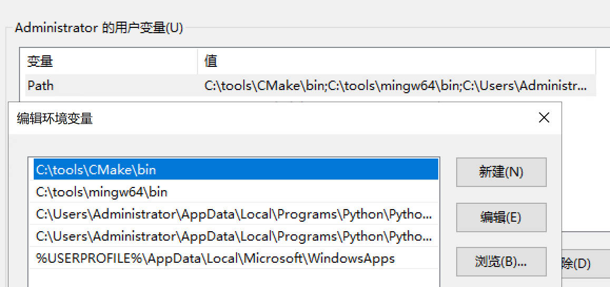
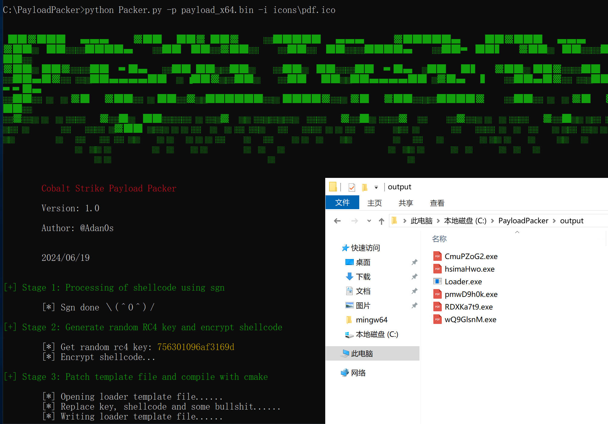
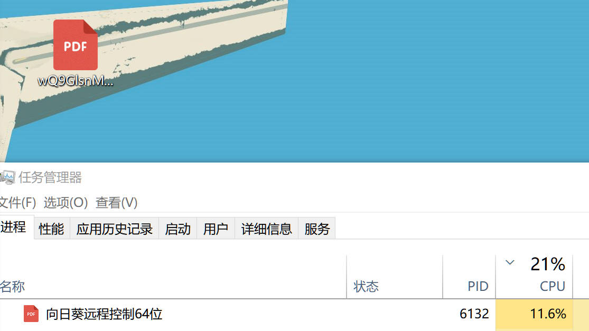
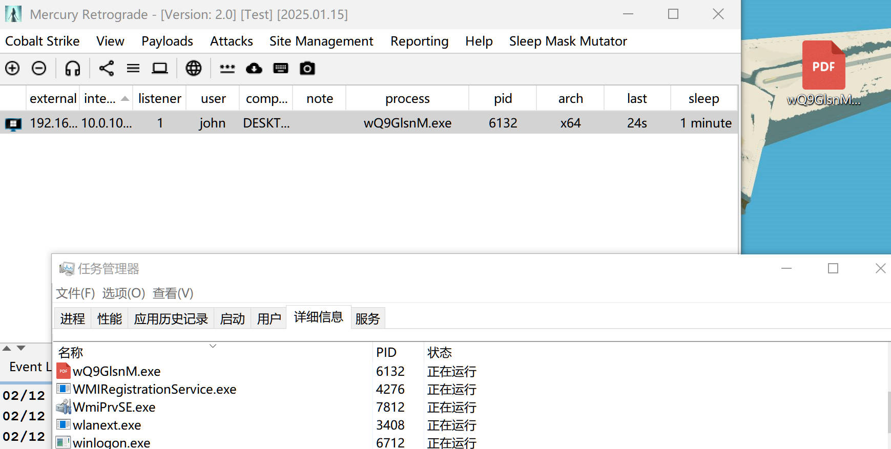

# PlayloadPacker

一键生成免杀木马，流程：

1. sgn处理shellcode
2. RC4加密处理后的shellcode，每次随机生成密钥
3. 填入Loader模板并进行编译
4. 添加资源，包括描述信息、图标等，生成多个不同exe

Loader模板中包含了以下技术（部分已注释，自行选择是否启用）：
1. 反沙箱（检测鼠标移动、检测进程数、检测CPU数、检测内存大小、检测微信进程、质数运算真睡眠）
2. 冷门回调函数执行shellcode
3. 一些垃圾代码，使得文件更趋于正常程序（MFC库、sqlite库、字符串输出等）

**注意：代码写于一年前，早已不免杀，仅作参考用途**

# 免责声明
1. 仅限用于技术研究和学习，使用者必须遵守《中华人民共和国网络安全法》，若将代码做其他用途，由使用者承担全部法律及连带责任，作者及发布者不承担任何法律及连带责任。
2. 作者保证无后门，不放心可自行替换include目录下的第三方工具或在虚拟机中使用

# 环境配置
需要配置gcc编译环境，使用Mingw-w64，并：

1. 修改`Packer.py`361行（调用`compile_with_cmake`）处`g++.exe`和`gcc.exe`的两个路径
2. 环境变量中添加mingw和cmake路径



# 目录结构
```
PayloadPacker
├─ README.md
├─ requirements.txt     # Packer脚本需要的第三方包或库
├─ Packer.py            # Packer脚本主体
├─ Loader               # Loader模板目录
│  ├─ src
│  │  ├─ main.cpp.temp  # Loader模板
│  ├─ res               # 资源目录
│  ├─ libs              # 其他库
│  └─ include           # 其他无害代码
├─ include              # 打包过程中用到的一些第三方工具或脚本，可自行替换为你放心的版本
├─ icons                # 图标目录                        
├─ config               
│  ├─ cert.txt          # 证书信息目录，可自行按格式添加内容
│  └─ description.txt   # 描述信息目录，可自行按格式添加内容
└─ certs                # 签名证书存放
```

# 使用
```
python Packer.py -p beacon_x64.bin -i icons\pdf.ico -n 10 -maxc 5

-p      Cobalt Strike生成的Raw格式payload路径（.bin文件）
-i      图标文件所在的路径
-n      要生成的图标数量，默认5个
-maxc   图标最大颜色变化范围，默认为8
```

*数字签名功能已被注释，因为实测效果并不好*

# 运行截图


质数运算的CPU占用较高：





# 致谢
https://github.com/Pizz33/360QVM_bypass 用到了项目的部分代码